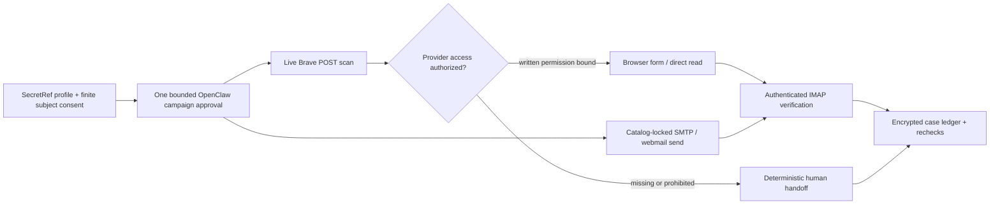

# RightOut

[](https://github.com/Olli0103/rightout/actions/workflows/ci.yml)
[](https://github.com/Olli0103/rightout/releases)
[](LICENSE)

**Self-hosted, evidence-first data-broker removal for OpenClaw — autonomous where the operator and provider have actually authorized it.**

RightOut scans live people-search exposure, submits catalog-locked form and
email requests, completes supported verification, tracks ambiguous writes, and
rechecks listings. Subject data stays in OpenClaw SecretRefs and encrypted local
state; tool inputs and reports use opaque references.

## Release truth, without marketing math

RightOut `0.8.1` clean-room represents the complete normalized contract surface
from pinned Hermes Unbroker commit
`e589b739ca70eba00aa90fd3d0228bada00dbf8f`: 22 exact broker IDs and their
20-form/one-email/one-phone method, route, input, and verification metadata.
It also implements campaign, verification, registry, reporting, and recheck
workflow classes. That is not a claim that 20 provider-specific Unbroker
playbooks were copied or independently replayed.

That does **not** mean 20/20 forms may legally run unattended by default.
The current primary-source review found:

| Gate | Current evidence |
| --- | ---: |
| Pinned broker IDs and normalized method/route/input contracts | 22/22 |
| Generic one-page synthetic form-contract tests | 20/20 |
| Independently staged provider-specific multi-step E2E | PeopleConnect only |
| Published terms explicitly allowing automation | 0/22 |
| Published terms explicitly prohibiting automation | 8/22 |
| Automation permission still `needs_evidence` | 14/22 |
| Default autonomous form routes | 0/20 |

RightOut therefore requires a current, separately obtained written provider
authorization, bound to the exact reviewed terms contract, before a publisher
form lane
can even enter OpenClaw approval. Operator consent, subject consent, or a broad
attestation cannot substitute for it. Without that evidence the route is a
deterministic human handoff.

So the precise answer to “100% Unbroker?” is:

- **100% pinned broker/method/route/input contract coverage:** yes, 22/22;
- **100% exact provider-specific playbook choreography:** no; the generic
  bounded engine is synthetic-tested for all 20 form contracts, while only the
  PeopleConnect multi-step flow has its own staged E2E;
- **100% capability parity:** no; documented gaps include default full autonomy,
  challenge clearance, browser-only authenticated inbox verification, and
  retrievable screenshots;
- **100% autonomous default against current public provider terms:** no, and no
  compliant product can honestly promise that from the evidence currently
  available.

See the [machine parity evidence](docs/unbroker-parity-evidence.json),
[provider-terms matrix](docs/provider-terms-review.md), and
[feature benchmark](docs/feature-benchmark.md).



## What it can do

| Area | Capability |
| --- | --- |
| Live scan | Country-aware Brave Web Search POST discovery across 56 code-enforced catalog lanes: 30 people-search plus 26 EU/US controller/B2B domains. Three controller portal lanes and Spokeo retain their catalog `human_only`/published-terms gates. Campaigns drain deterministic four-broker batches. Query/result bodies and result URLs are never persisted or returned |
| Discovery | ISO-country profiles require an explicit country, then use Brave country/language targeting (for example `DE/de`) or an explicit worldwide fallback, plus full name, aliases, current/prior locations, subject emails and phones. This is public-index discovery only: localization does not prove real broker discovery, private-inventory visibility, identity, or absence. Vectors stay within Brave's 400-character/50-word limits without truncating identity values |
| Exact verification | A separate, provider-authorized direct read matches full name plus a strong configured corroborator before `found` |
| Autonomous campaigns | One native `allow-once` creates a revocable grant for one opaque profile, exact brokers/effects, 1–720 hours, and 1–2,000 effects |
| Form execution | Generic bounded ARIA-ref engine for 20 normalized contracts plus a staged PeopleConnect path; minimum disclosure, intent-before-click, semantic-state receipts, and provider-authorization default deny |
| PeopleConnect flow | Email initiation, authenticated Gmail IMAP, same named browser profile, exact record selection, separate DOB approval, and suppression — only with current written PeopleConnect authorization |
| Challenges | Bounded host-side arithmetic; CAPTCHA, static text challenge, OTP, security question, ID, phone, fax, mail, payment, and account gates stop for a human |
| Email | Catalog-locked SMTP plus privacy-redacted Gmail compose; a rescue email is reported independently from an unavailable primary form |
| Verification | Receiver-authenticated Gmail IMAP plus HTTPS/domain/credential/port phishing checks; browser-only inbox search is a zero-I/O human gate |
| EU/EEA | 18 catalog-locked controller email lanes for evidenced GDPR erasure/objection channels, with minimum fields and human-reviewed outcomes |
| US registries | Live California registry CSV, Vermont/Oregon/Texas portal routing, and human-filed California DROP tracking |
| Rechecks | Encrypted exact-listing handles, timed absence confirmation, reappearance detection, and OpenClaw Cron handoff |
| Reporting | PII-safe Markdown, structured JSON, consolidated digest, and Google Sheets-compatible rows |
| Recovery | Encrypted campaign/case resume, intent-before-write, duplicate suppression, uncertain-write reconciliation, retention, purge, and key rotation; active browser sessions are memory-only and require manual tab/draft cleanup after an unclean Gateway stop |

The broader catalog contains 56 US/EU entries, 56 code-enforced combined
live-index scan lanes after the pinned reference overlay (30 people-search and
26 controller/B2B), and 28 independently locked executable
email/removal targets, including 18 EU/EEA controller lanes. Those
additional routes never substitute for a missing Unbroker reference contract or
provider-specific playbook.

## What it intentionally cannot do

- bypass publisher terms, robots/access controls, CAPTCHA, OTP, identity checks,
  or a provider's requirement for phone, fax, mail, payment, or an account;
- automate a form from subject consent alone; every form needs a current written
  provider authorization and matching contract digest;
- prove that a broker received, honored, or completed a request merely because
  SMTP or a browser click succeeded;
- authenticate inbound mail from Gmail's normal browser UI; autonomous inbound
  verification requires the pinned receiver-authenticated IMAP contract;
- solve distorted static-text challenges; only strict arithmetic is computed
  locally, while static text is human-only;
- return retrievable screenshots. It records a reproducible commitment over a
  PII-redacted semantic state plus exact direct-read evidence, not an image or
  Optery/Kanary-style before/after proof;
- discover private broker databases, guarantee deletion, prevent future
  reappearance, or cover every controller/identifier on the internet;
- provide a hosted dashboard, managed human specialist, family billing/admin,
  custom arbitrary-URL takedowns, Google/social cleanup, dark-web monitoring, or
  the proprietary 400–1,000+ inventories advertised by managed services;
- self-schedule. Recurrence is an explicit OpenClaw Cron/operator deployment
  responsibility.

## Evidence semantics

- `indirect_exposure`: an official-domain candidate appeared in Brave or a
  separately authorized browser discovery; identity is not proven.
- `found`: a separately authorized exact page matched full name plus a strong
  corroborator.
- `submitted`: transport or observed browser transition shows the request left
  RightOut; broker receipt and deletion remain unproven.
- `verification_pending`: a confirmation step is outstanding.
- `submission_uncertain`: a provider write may have started; automatic retry is
  blocked until separately approved reconciliation.
- `confirmed_removed`: two time-separated direct absences across the complete
  known encrypted listing set, or a human-reviewed controller response limited
  to that controller.
- `reappeared`: a trusted direct read found a previously confirmed listing.

## Approval and secret boundary

OpenClaw resolves active SecretRefs eagerly during Gateway activation into an
in-memory runtime snapshot. They are **not** first resolved after approval.
RightOut's narrower guarantee is that no subject PII or provider credential is
sent to an external provider until the exact native approval is satisfied or a
matching finite campaign grant is validated. Local setup/status/export/doctor
tools may read resolved configuration or the state key to validate/decrypt local
state and probe the loopback browser service, but never return those values.
Campaign preapproval binds only opaque scope and does not read those secrets.
Installed plugins are trusted in-process code; approvals are operator guardrails,
not hostile-plugin or multi-tenant isolation.

Campaign bindings include the immutable profile digest, combined core/parity/
provider-terms catalog digest, browser and transport configuration, provider
authorization records, expiry, and effect budget. Any mutation fails before
provider I/O. DOB always needs its own exact critical `allow-once`.
The campaign approval also discloses the possible subject-field classes,
recipient/embedded-processor classes, selected browser backend, readable pinned
canonical target labels or explicit short broker lists, concrete effect names,
scope, lifetime, and effect budget.

## Tool surface

RightOut declares 35 OpenClaw tools:

- planning and health: setup, doctor, catalog/parity health, campaign start/
  status/next/revoke, next actions, due rechecks, case status, export;
- discovery: live scan, publisher-browser session, direct rescan, registry
  refresh/status/search;
- removal: fixed email, parity rescue email, closed form, generic form session,
  and redacted webmail compose;
- verification/outcome: authenticated IMAP poll/link-open, browser-mail human
  handoff, controller outcome, and uncertain-write reconciliation;
- governance: DROP filing record, subject purge, and state-key rotation.

The manifest is the canonical exact tool list.

## Install

For the tagged `0.8.1` release, install only the versioned GitHub artifact after
verifying both its checksum and workflow attestation:

```bash
VERSION=0.8.1
mkdir "rightout-${VERSION}" && cd "rightout-${VERSION}"
gh release download "v${VERSION}" --repo Olli0103/rightout
shasum -a 256 -c RELEASE-SHA256SUMS
gh attestation verify "olli0103-openclaw-rightout-${VERSION}.tgz" \
  --repo Olli0103/rightout \
  --signer-workflow Olli0103/rightout/.github/workflows/release.yml \
  --source-ref "refs/tags/v${VERSION}" \
  --deny-self-hosted-runners
openclaw plugins install "./olli0103-openclaw-rightout-${VERSION}.tgz"
openclaw plugins enable rightout
openclaw plugins inspect rightout --runtime --json
openclaw plugins doctor
```

Use `sha256sum -c RELEASE-SHA256SUMS` on Linux. Then follow
[INSTALL.md](INSTALL.md) for SecretRefs, provider authorization records,
attestations, browser profiles, tool policy, Cron, and the authorized canary.

For development:

```bash
git clone https://github.com/Olli0103/rightout.git
cd rightout
npm ci --ignore-scripts
npm run check
make test
```

## Security and compliance

RightOut is compliance-supporting software, not legal advice or certification.
Operators remain responsible for subject authority, applicable law, provider
terms and agreements, controller/processor roles, transparency, lawful basis,
international transfers, retention, DPIA/TIA duties, and Gateway/OS isolation.

Release validation uses only mocked providers and `.invalid` identities. It
never runs a real-person scan, real mailbox, live form, or broker write. The
first live action belongs in an authorized deployment under the
[canary protocol](docs/authorized-canary.md).

Start with [SECURITY.md](SECURITY.md), [privacy posture](docs/privacy-posture.md),
[approval boundary](docs/approval-boundary.md), [deployment compliance](docs/deployment-compliance.md),
and [OpenClaw conformance](docs/openclaw-conformance.md).

Clean-room contributions must use official facts only. Commercial lists,
copied playbooks/templates/prose, and BADBOOL-derived records are prohibited.
See [CONTRIBUTING.md](CONTRIBUTING.md). License: MIT.
