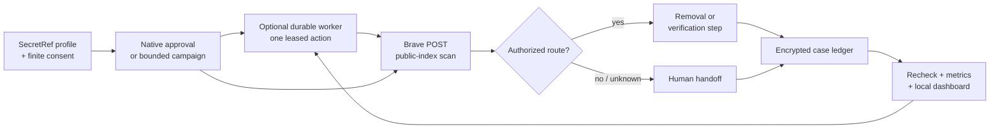

# RightOut

[](https://github.com/Olli0103/rightout/actions/workflows/ci.yml)
[](https://github.com/Olli0103/rightout/releases)
[](LICENSE)

**Take your data-broker footprint back — without outsourcing the whole process
to a black-box privacy service.**

RightOut turns OpenClaw into a self-hosted privacy operator. It scans public
search indexes for possible exposure, runs authorized removal workflows, handles
supported verification, tracks uncertain outcomes, and checks again later. An
explicitly enabled durable worker can keep a finite campaign moving without
turning an agent prompt into open-ended authority.

Public tool inputs and reports use opaque references, and persisted subject state
is encrypted. Active SecretRefs are resolved into the Gateway's in-memory runtime
snapshot. External actions are scoped, writes require approval, and every result
says exactly what is known — and what is not.

> **The rule is simple:** if RightOut cannot prove it, RightOut does not claim it.

## Why RightOut

- **Self-hosted by design.** You operate the system and control its secrets,
  retention, browser, mailbox, and schedule.
- **Evidence over optimism.** A search hit is not identity proof. A submitted
  request is not a deletion. An uncertain write is never silently retried.
- **Autonomous within hard boundaries.** One native approval can authorize a
  finite, revocable campaign for an exact profile, broker set, effect set,
  lifetime, and budget.
- **Closed-loop when you ask for it.** A session-bound worker leases one exact
  action, accepts success only from the host-observed terminal result of that
  exact command, checkpoints it in encrypted state, backs off on transient
  failures, and stops on drift, ambiguity, revocation, or a human gate.
- **Provider rules are runtime rules.** Missing or prohibited automation
  permission produces a deterministic human handoff, not a clever workaround.
- **Built to recover.** Campaigns, cases, rechecks, duplicate suppression,
  retention, purge, and key rotation survive ordinary restarts without turning
  ambiguity into success.

## What you get

| Area | Current capability |
| --- | --- |
| Live discovery | Country-aware Brave Web Search POST scans across 56 code-enforced public-index lanes: 30 people-search plus 26 EU/US controller and B2B domains |
| Removal | 28 independently locked email/removal targets, including 18 EU/EEA controller lanes |
| Campaigns | Revocable grants for one opaque profile, exact brokers/effects, 1–720 hours, and 1–2,000 broker-effect units |
| Durable autonomy | Encrypted workers, single leases, exact-command result receipts, lease watchdogs, restart recovery, exponential backoff, current-session scheduling, explicit Cron handoff, resume approval, and revocation |
| Recipe trust | Release-attested 22-route built-in pack, strictly Ed25519 external packs, expiry, exact-domain binding, and semantic/sensitive drift quarantine |
| Browser forms | Bounded semantic form engine for 20 normalized contracts plus a separately staged PeopleConnect flow |
| Email | Catalog-locked password or short-lived OAuth2 SMTP and privacy-redacted Gmail compose, with rescue routes reported separately |
| Verification | Receiver-authenticated Gmail IMAP, authenticated thread-bound controller reply candidates, pinned HTTPS/domain checks, explicit human gates, and a separate link-open effect |
| Rechecks | Encrypted listing handles, timed absence confirmation, reappearance detection, and OpenClaw Cron handoff |
| Evidence | Optional encrypted content-addressed snapshots, non-extending bounded retention, tamper checks, and separately approved managed local exports that expire and purge with their subject |
| Custom targets | Out-of-band encrypted intake with opaque handles; unknown routes remain quarantined until a signed recipe and current exact permission exist |
| Family / team | Session-bound owner, manager, and viewer roles with exact profile scopes; full-operator direct invoke must be disabled in team mode |
| Reporting | PII-safe Markdown, structured JSON, consolidated digests, Google Sheets-compatible rows, evidence-based effectiveness metrics, and static local HTML/JSON dashboards |

RightOut declares 50 OpenClaw tools across readiness, discovery, campaigns,
durable workers, removal, verification, evidence, reporting, and governance.
The plugin manifest is the canonical exact tool list.

## How it works



Live discovery never fetches a publisher page. Brave query and result bodies,
result URLs, raw mail, and raw page content are not persisted or returned. A
publisher read, form submission, email, inbox poll, and verification-link open
are distinct effects with distinct gates.

### The autonomy loop

1. `rightout_start_campaign` creates a finite, encrypted standing grant after
   one native `allow-once`.
2. `rightout_worker_enable` binds a durable worker to that campaign and the
   current trusted OpenClaw session after a second native approval.
3. Each wake leases one deterministic command from a fixed RightOut
   tool/parameter grammar. The worker cannot invent a tool or widen scope.
4. The host hook binds the invocation to the issued tool and normalized
   parameters. Only its exact terminal result creates a durable success receipt;
   interactive sessions, uncertain results, and mismatches stop for a human.
5. Revocation closes future work. `rightout_worker_resume` requires a new
   approval and the original unchanged session, campaign, runtime, catalog, and
   signed-recipe policy.

While an action is unresolved, a lease watchdog remains scheduled. Gateway
startup reconstructs missing worker wakes from the encrypted session route.
Unsupported schedulers do not disappear into “best effort”: RightOut returns a
PII-free explicit Cron handoff. See the [installation guide](INSTALL.md) for the
worker, team, evidence, and dashboard configuration.

## Proof states, not vibes

| State | What it actually means |
| --- | --- |
| `indirect_exposure` | An official-domain candidate appeared in Brave or an authorized browser discovery. Identity is not proven |
| `found` | A separately authorized exact page matched the full name plus a strong configured corroborator |
| `submitted` | Transport or an observed browser transition shows that the request left RightOut. Receipt and deletion remain unproven |
| `verification_pending` | A supported confirmation step is still outstanding |
| `submission_uncertain` | A provider write may have started. Automatic retry is blocked pending explicit reconciliation |
| `confirmed_removed` | Two time-separated trusted direct absences cover the complete known encrypted listing set, or a human-reviewed controller response confirms only that controller's scope |
| `reappeared` | A trusted direct read found a previously confirmed listing again |

## Coverage you can verify

RightOut `0.9.0` ships a clean-room, machine-validated broker contract catalog.
The counts below describe executable software surfaces, not measured deletion
success and not permission to automate a provider.

| Gate | Current evidence |
| --- | ---: |
| Broker IDs and normalized method/route/input contracts | 22/22 |
| Generic one-page synthetic form-contract tests | 20/20 |
| Independently staged provider-specific multi-step E2E | PeopleConnect only |
| Authenticated verification transports | Gmail IMAP + bound Gmail browser profile |
| Published terms explicitly allowing automation | 0/22 |
| Published terms explicitly prohibiting automation | 8/22 |
| Automation permission still `needs_evidence` | 14/22 |
| Default autonomous form routes | 0/20 |

All 20 form contracts run through the bounded semantic engine in synthetic E2E
tests; PeopleConnect additionally has a separately staged, same-browser
multi-step flow. Browser-webmail verification requires an exact logged-in
profile binding, recipient match, an allowed `signed-by` or `mailed-by` domain,
and an HTTPS confirmation link on an allowlisted broker domain.

Autonomous form execution remains closed by default. Each live provider route
requires current written authorization bound to the reviewed terms contract.
Subject or operator consent cannot replace provider permission.

The broader catalog adds 56 code-enforced scan lanes and 28 locked executable
email/removal targets. It does **not** add private broker inventory, identity
proof, or measured real-world removal effectiveness. Those remain
`needs_evidence` until an authorized deployment produces evidence.

See the [provider-terms matrix](docs/provider-terms-review.md)
and [feature benchmark](docs/feature-benchmark.md).

## Boundaries that matter

RightOut intentionally will not:

- bypass provider terms, access controls, dynamic or behavioral CAPTCHA, OTP,
  identity checks, phone, fax, mail, payment, or account requirements;
- turn subject consent into permission to automate a provider's form;
- treat a search-index candidate as the subject's record;
- treat SMTP acceptance or a browser click as confirmed deletion;
- silently retry a provider write whose outcome is ambiguous;
- discover private broker databases or promise universal, permanent deletion;
- provide a hosted dashboard, managed specialist, family billing, enterprise
  identity administration, arbitrary-target execution, Google/social cleanup,
  or dark-web monitoring;
- return Optery/Kanary-style screenshots; RightOut stores reproducible,
  PII-redacted semantic evidence instead;
- create unbounded recurrence. A durable worker may schedule only its current
  trusted session after native approval; unsupported hosts return an explicit
  Cron handoff, and campaigns still expire after at most 720 hours.

Simple static arithmetic can be computed locally; an explicitly identified
static text challenge can accept its one short snapshot-bound value. Dynamic CAPTCHA,
slider, OTP, security-question, ID, account, payment, phone, fax, and mail gates
stop safely. Active browser sessions are memory-only, so an unclean Gateway stop
may require manual tab or draft cleanup before the encrypted workflow resumes.

## Privacy and approval boundary

Public tool inputs and reports contain opaque references, not names, addresses,
emails, phones, credentials, raw messages, or listing URLs. Subject state is
encrypted locally. Campaign bindings cover the immutable profile digest,
catalog and provider-terms digests, routing configuration, expiry, revocation,
and effect budget. A changed binding fails before provider I/O.

One detail matters: OpenClaw resolves active SecretRefs eagerly into the Gateway's
in-memory runtime snapshot. RightOut does not claim otherwise. Its enforceable
guarantee is narrower and testable: no subject PII or provider credential is
sent to an external provider before the exact native approval succeeds or a
matching finite campaign grant is validated. Installed plugins remain trusted
in-process code. Team roles isolate configured agent sessions and subject
scopes inside one deployment; they are not a hosted multi-tenant boundary, and
team mode critically requires every RightOut tool to be denied on the
full-operator `/tools/invoke` surface.

Read the full [privacy posture](docs/privacy-posture.md),
[approval boundary](docs/approval-boundary.md), and
[OpenClaw conformance statement](docs/openclaw-conformance.md).

## Install a verified release

Use a versioned GitHub artifact, checksum, and workflow attestation. Do not move
an untagged `main` checkout into production.

> If the requested tag or attested archive does not exist, stop: that release
> has not been published yet.

```bash
VERSION=0.9.0
mkdir "rightout-${VERSION}" && cd "rightout-${VERSION}"
gh release download "v${VERSION}" --repo Olli0103/rightout
if command -v sha256sum >/dev/null 2>&1; then
  sha256sum -c RELEASE-SHA256SUMS
else
  shasum -a 256 -c RELEASE-SHA256SUMS
fi
gh attestation verify "olli0103-openclaw-rightout-${VERSION}.tgz" \
  --repo Olli0103/rightout \
  --signer-workflow Olli0103/rightout/.github/workflows/release.yml \
  --source-ref "refs/tags/v${VERSION}" \
  --deny-self-hosted-runners
openclaw plugins install "./olli0103-openclaw-rightout-${VERSION}.tgz"
openclaw plugins enable rightout
openclaw plugins inspect rightout --runtime --json
openclaw plugins doctor
```

Use `sha256sum -c RELEASE-SHA256SUMS` on Linux. Then follow the
[installation guide](INSTALL.md) for SecretRefs, attestations, browser and mail
transports, tool policy, and readiness checks.

The first real-person action is an authorized deployment canary, not a release
test. Start with one profile and one Brave discovery lane under the
[canary protocol](docs/authorized-canary.md). Never place a real profile or
credential in chat, tool parameters, test fixtures, or repository files.

## Development

```bash
git clone https://github.com/Olli0103/rightout.git
cd rightout
npm ci --ignore-scripts
npm run check
make test
```

Release validation uses mocked providers and `.invalid` identities. It does not
perform a real-person scan, mailbox read, form submission, email, link open, or
broker write.

## Security, compliance, and clean-room policy

RightOut is compliance-supporting software, not legal advice or certification.
Operators remain responsible for subject authority, applicable law, provider
terms and agreements, controller/processor roles, transparency, lawful basis,
international transfers, retention, DPIA/TIA duties, and Gateway/OS isolation.

Start with [SECURITY.md](SECURITY.md), the
[deployment compliance guide](docs/deployment-compliance.md), and the verified
release evidence shipped with each archive.

Clean-room contributions use official facts only. Commercial lists, copied
playbooks, copied templates/prose, and BADBOOL-derived records are prohibited.
See [CONTRIBUTING.md](CONTRIBUTING.md).

MIT licensed. Self-hosted. Evidence first. No deletion theater.
