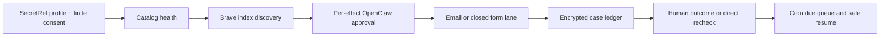

# RightOut

[](https://github.com/Olli0103/rightout/actions/workflows/ci.yml)
[](https://github.com/Olli0103/rightout/releases)
[](LICENSE)

**Self-hosted, evidence-first data-broker removal for OpenClaw.** RightOut scans
consented people-search exposure, submits supported US and EU/EEA requests,
tracks ambiguous outcomes, and resumes due work—without giving the model raw
PII or standing permission to contact providers.

RightOut `0.7.1` keeps every live disclosure, publisher read, inbox read,
confirmation-link open, email, and form write behind a fresh native OpenClaw
`allow-once`. The agent cannot create, persist, or reuse an approval.



## Coverage snapshot

| Capability | v0.7.1 |
| --- | ---: |
| Clean-room catalog entries | 56 |
| Brave discovery lanes | 21 |
| Executable targets | 28 |
| EU/EEA controller-email targets | 18 |
| US executable targets | 10 |
| Direct known-listing rechecks | 2 |
| Receiver-authenticated inbox flows | 1 |

Twenty-seven executable targets are fixed-recipient email requests; one is a
closed PeopleConnect browser-form initiation. This exceeds the raw target count
of the pinned public Hermes Unbroker snapshot but is not equivalent to the much
broader web-form mix or private inventory claimed by managed services. See
[broker coverage](docs/broker-coverage.md) and the [feature benchmark](docs/feature-benchmark.md).

## What a campaign does

1. Check catalog freshness without network access. A stale source disables live
   provider I/O until official facts are reviewed and released.
2. Build a deterministic plan across all 56 entries and resume pending or
   ambiguous cases before starting new writes.
3. Search at most two supported people-search brokers per approved Brave call.
   Positive results are `indirect_exposure`; absence is `inconclusive`.
4. Submit one catalog-locked, minimum-disclosure email or browser recipe after a
   separate approval. SMTP acceptance is only `submitted`; a form transition is
   only `verification_pending`.
5. Poll the supported mailbox lane, open a broker-bound confirmation handle, or
   recheck an encrypted exact URL only through separate approvals.
6. Resume due work through official OpenClaw Cron. CAPTCHA, identity documents,
   government verification, legal judgment, and unclear portals remain human.

The encrypted ledger preserves intent before every write. A crash or uncertain
provider result becomes `submission_uncertain` and cannot retry until the
operator separately records whether the write started. Encrypted subject cases
expire after 30-730 inactive days (365 by default), can be purged per subject,
and support an approval-gated restart-safe key rotation.

## Tools

Provider I/O or critical local state, optional and non-replay-safe:

- `rightout_live_scan`
- `rightout_direct_rescan`
- `rightout_submit_removal`
- `rightout_submit_form_removal`
- `rightout_poll_verification`
- `rightout_open_verification`
- `rightout_purge_subject_state`
- `rightout_record_controller_outcome`
- `rightout_reconcile_submission`
- `rightout_rotate_state_key`

Read-only and replay-safe:

- `rightout_next_actions`
- `rightout_case_status`
- `rightout_catalog_health`
- `rightout_due_rechecks`

Every public argument is an opaque reference. Raw names, addresses, emails,
phones, credentials, queries, listing URLs, messages, page bodies, and controller
responses are excluded from tool results and the durable case ledger.

## Install a verified stable release

Prerequisites: OpenClaw `2026.6.11+`, Node.js `22.19+`, Python `3.11+`, `gh`, and
`shasum` (macOS) or `sha256sum` (Linux).

```bash
VERSION=0.7.1
mkdir "rightout-${VERSION}" && cd "rightout-${VERSION}"
gh release download "v${VERSION}" --repo Olli0103/rightout
shasum -a 256 -c RELEASE-SHA256SUMS
gh attestation verify "olli0103-openclaw-rightout-${VERSION}.tgz" \
  --repo Olli0103/rightout \
  --signer-workflow Olli0103/rightout/.github/workflows/release.yml \
  --source-ref "refs/tags/v${VERSION}" \
  --deny-self-hosted-runners
openclaw plugins install "./olli0103-openclaw-rightout-${VERSION}.tgz"
openclaw plugins enable rightout
openclaw plugins inspect rightout --runtime --json
openclaw plugins doctor
```

Use `sha256sum -c RELEASE-SHA256SUMS` on Linux. The release also publishes its
SBOM, catalog provenance, and machine-readable workflow/source evidence. For
SecretRefs, approvals, retention, key rotation, Cron, and the full readiness
gate, follow [INSTALL.md](INSTALL.md).

For source development only:

```bash
git clone https://github.com/Olli0103/rightout.git
cd rightout
npm ci --ignore-scripts
npm run check
make test
```

## Evidence semantics

- `indirect_exposure`: Brave official-domain index signal, not identity proof.
- `submitted`: outbound SMTP acceptance, not broker receipt or deletion.
- `verification_pending`: form/mail step, not removal.
- `submission_uncertain`: possible write; never retry automatically.
- `confirmed_removed`: either two timed direct absences across the complete
  encrypted known-listing set, or a human-reviewed controller response scoped
  only to that controller.
- `reappeared`: trusted direct presence after a prior narrow confirmation.

New or unindexed URLs, other identifiers/controllers, private databases, legal
exceptions, and future reappearance remain explicit coverage gaps. Browser or
device advertising preferences never become controller-wide deletion proof.
California DROP is a separate human government workflow.

## Security and compliance boundary

RightOut is compliance-supporting software, not legal advice or certification.
Operators remain responsible for subject authority, statutory eligibility,
controller/processor roles, provider contracts, transparency, lawful basis,
international transfers, retention, DPIA/TIA duties, publisher terms, and
Gateway/OS isolation.

Start with [security](SECURITY.md), [privacy](docs/privacy-posture.md), the
[deployment compliance gate](docs/deployment-compliance.md), and
[OpenClaw conformance](docs/openclaw-conformance.md). Before a first real
deployment, execute the [authorized canary protocol](docs/authorized-canary.md)
under the operator's own authority; the repository test suite deliberately
contains no real PII or broker traffic.

## Development

```bash
npm ci --ignore-scripts
npm run check
npm run test:coverage
make test
make scan-only-dummy
make e2e-dummy
make installer-test
```

Use only synthetic `.invalid` identities and mocked or isolated providers.
Never run a real scan, send an email, submit a form, open a broker link, or use
real PII as a test. Catalog additions must come clean-room from official sources;
commercial lists, privacy guides, BADBOOL material, copied templates, and copied
prose are prohibited. See [CONTRIBUTING.md](CONTRIBUTING.md). License: MIT.
